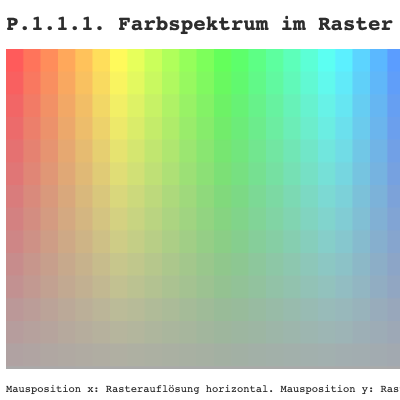

# Collection of exercises from the [Generative Design](http://www.generative-gestaltung.de/2/) book

## P.1.0 Hallo Farbe

## P.1.1.1. Farbspektrum im Raster

## P.1.1.2. Farbspektrum im Kreis

## P.1.2.1. Farbpaletten durch Interpolation

## P.1.2.2. Farbpaletten aus Bildern

## P.1.2.3.01 Farbpaletten aus Regeln (1)

## P.1.2.3.02 Farbpaletten aus Regeln (2)

## P.1.2.3.03 Farbpaletten aus Regeln (3)

